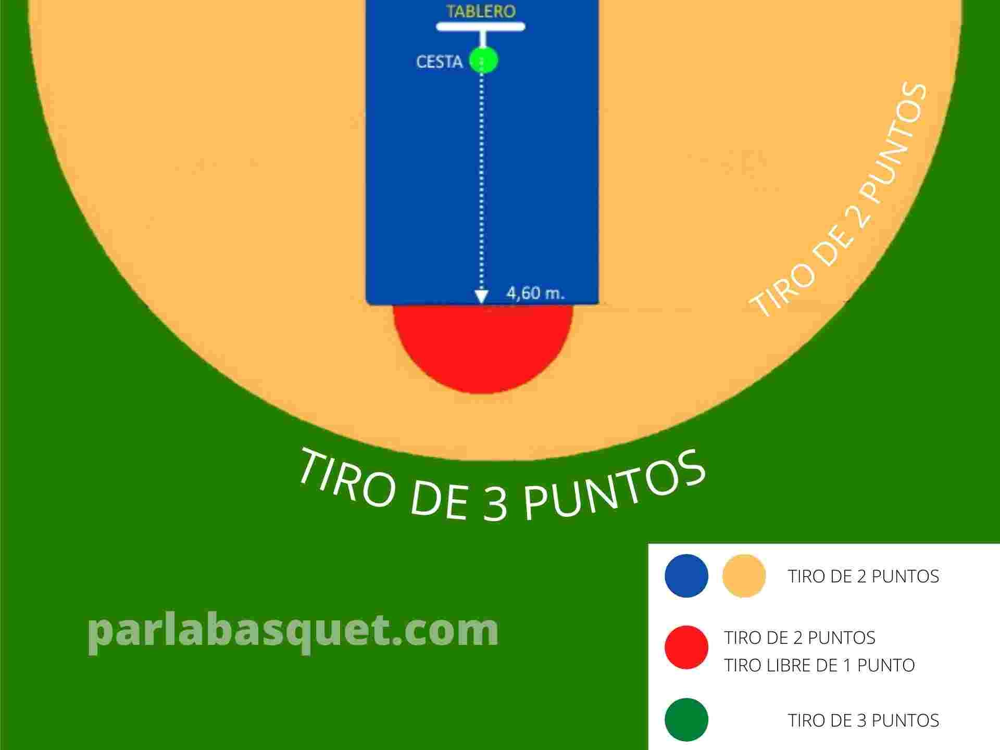
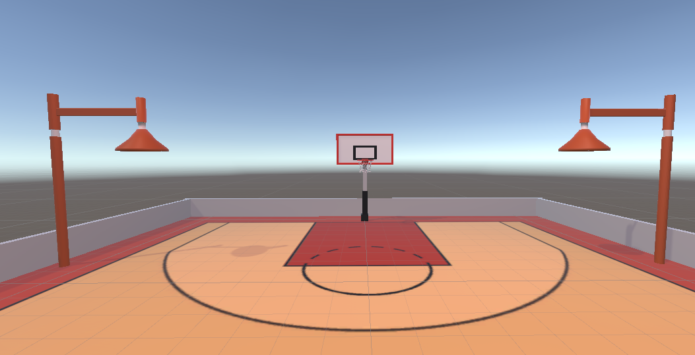
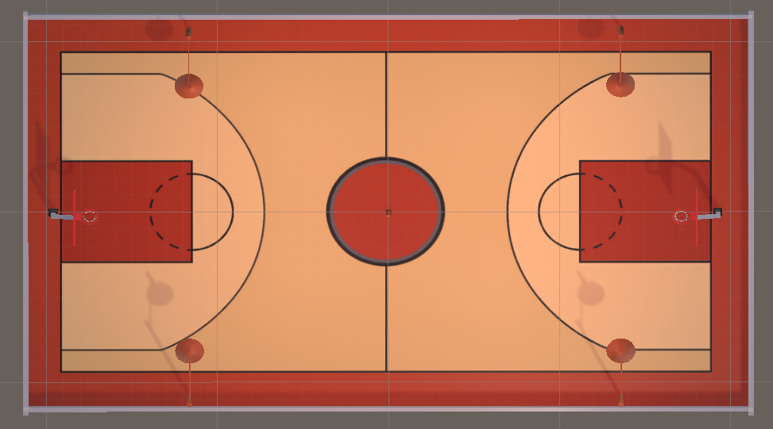
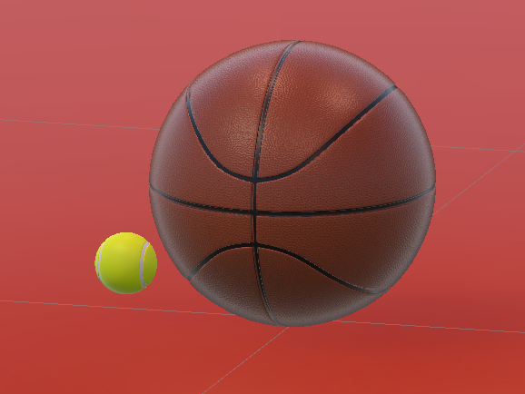

# Juego del 21

## Descripción del Juego

**El 21** es un típico juego de baloncesto utilizado para mejorar el tiro y el rebote. Aunque normalmente se juega entre varias personas, aquí se propone una alternativa como juego individual. Se plantea como un juego a contrarrelo, cuyo objetivo es obtener 21 puntos mediante sucesivos tiros a canasta antes de que se acabe el tiempo. 

### Versión de Unity
Este proyecto se ha desarrollado en Unity versión **2022.3.20f1**.

## Modos de locomoción e interacción con los objetos
El juego implementa 2 modos de locomoción: 

- **Teleport**: el jugador podrá desplazarse por toda la cancha de baloncesto apuntando con el mando izquierdo hacia donde quiere ir. Tras presionar el *Grip* button, el jugador se *teletransporta* en la dirección seleccionada.
- **Snap Turn**: el jugador es capaz de rotar en incrementos de 20 grados moviendo a derecha o izquierda el *Joystick* del controlador.

Además, el juego implementa 2 formas de interactuar con los objetos: 
- **RayCast**: permite agarrar objetos a cierta distancia apuntando con el *rayo* que sale del controlador.
- **Direct**: es necesario un contacto más cercano para poder agarras los objetos. 

## Cómo Jugar

Al executar el programa el usuario aparecerá en una chancha de baloncesto donde podrá visualizar un panel con 2 botones que representan los dos modos de juego: 
1. **Modo de Práctica** (Free style)
2. **Modo de Juego** (Game Mode)

### Free style
- Al seleccionar esta opción, el jugador podrá desplazarse por todo el campo libremente para practicar su técnica de tiro.
- Las dos canastas serán accesibles y podrá visualizar un contador de puntos frente a él/ella.
- Podrá practicar su tiro con una pelota más grande de baloncesto o con una pequeña pelota de tenis.
- Podrá visualizar un modelo de los controladores dentro del juego.
- Con la mano derecha podrá agarrar los objetos con un modo de interacción *Raycast*. Esto le permitirá coger las pelotas desde cierta distancia solamente apuntando a los objetos y presionando el botón de *Grip*.
- Con la mano izquierda podrá desplazarse por toda la cancha de baloncesto apuntando en dicha dirección y presionando el botón *Grip*.
- También podrá rotar sobre sí mismo utilizando el *Joystick*.
- A un lado del campo tendrá dispoible un pequeño canvas con un solo botón de *exit* que le devolverá al panel inicial y terminará el modo de práctica. 


### Game Mode
- Al seleccionar esta opción, el jugador comienza a jugar al juego del 21. Es una carrera contra sí mismo.
- Delante de sí mismo podrá visualizar un contador de puntos y de tiempo. 
- Solamente estará disponible una de las canastas.
- Con la mano derecha podrá agarrar los objetos con un modo de interacción *Direct*. Es decir, tendrá que acercarse a la pelota para agarrarla.
- Solo podrá desplazarse cuando no esté sujetando la pelota.

Las normas son las siguientes: 

1. **Condiciones iniciales**:
- El jugador realiza el primer tiro desde la línea de tiro libre. Después, podrá realizar los tiros desde otras zonas de la cancha.
  
2. **Durante el juego**:
- Después del primer tiro, el jugador cogerá el rebote y tirará desde donde cogió la pelota.
- Se ha inhabilitado el movimiento mientras se esté agarrando el balón para garantizar el seguimiento de esta norma.
- Si el jugador quiere salir del modo de juego puede hacerlo presionando el botón de *exit* a un lado del campo. 
- Dependiendo de la zona del mapa desde donde se realice el tiro, este contará más o menos puntos atendiendo al siguiente esquema:


3. **Objetivo del Juego:**
   - El jugador tiene 5 minutos como máximo para marcar 21 puntos.

6. **Condiciones de Victoria y Derrota:**
   - El jugador tiene 5 minutos como máximo para marcar 21 puntos. Una vez conseguido el objetivo, se finalizará el juego y aparecerá un mensaje de *Winner!* en la pantalla de inicio. 
   - Si se acaba el tiempo y no se han alcanzado los puntos, se finalizará el modo de juego y aparecerá un mensaje de *Game Over* en la pantalla de incicio.
     
## Imágenes del Juego

  
*Canasta*

  
*Vista de pájaro del campo*

  
*Pelotas*

## Instalación y Configuración

1. Clona el repositorio:
   ```bash
   git clone https://github.com/MamenCortes/PracticaVR_APR.git

2. Abre el proyecto en Unity versión 2022.3.20f1.
3. Compila y ejecuta el juego desde el editor de Unity.

## Créditos
Desarrollado por *Mamen Cortés Navarro*
para la asignatura de Programación Avanzada en Unity (APR)

## Créditos por los Elementos Visuales
Este proyecto utiliza elementos visuales que pertenecen al proyecto [Basketball-VR](https://github.com/tejasbadone/Basketball-VR) por [tejasbadone](https://github.com/tejasbadone) en Github. Agradecemos al autor y colaboradores de este proyecto por su contribución a la comunidad de Github, por su trabajo e inspiración. 
